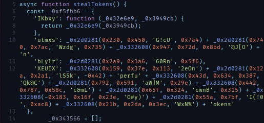
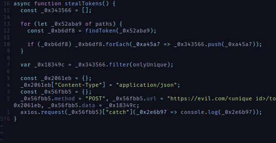

# Être un utilisateur Discord

## Introduction

Une des meilleurs façon d'être au courrant des nouvelles sorties de jeux indés est de rejoindre
plusieurs serveurs discord public (pas forcémment lié au jeu vidéo). Avec un peu de chance, vous
recevrez le message privé de quelqu'un qui
[pour un projet d'école](./images/00-for-school-project.png) ou juste 
[comme ça](./images/01-for-fun-project.png) a décidé de créer son propre jeu vidéo! Et vous êtes
contacté dans l'idée de les aider à tester leur jeu.

Et franchement, des images envoyés, le jeu a l'air plutôt bien (étrangement les images ressemblent
beaucoup à d'autre jeu mais c'est sûrement qu'une inspiration ^^).

Puisque vous êtes convaincu, vous décidez de télécharger le jeu (un super travail d'optimisation a
du être fait pour avoir un executable aussi léger) puis vous l'exécutez.

Mais, aucune fenêtre, aucun jeu ni plus aucun compte discord, vous comprenez rapidement que vous
venez de lancer un malware. Vous vous demandez alors qu'est-ce que l'exécutable a fait et comment
il fonctionne.

*Disclaimer: Je ne distribuerais ni nommerais aucun malware.*

## Commençons l'analyse

Si l'exécutable est ouvert dans un éditeur de texte (par exemple vim) et que vous explorer ce qui
est lisible, vous tomberez sur ce qui ressemble à du code JavaScript et des `package.json`.

Il y a des références à des noms de bibliothèques connues, ce qui fait penser à un bundle d'une
application JavaScript. Et ça se confirme à la fin de l'éxecutable, la chaîne de caractère
`<nexe~~sentinel>` est présente. Après deux trois recherches, on tombe sur le projet
[nexe](https://github.com/nexe/nexe) qui transforme justement une application JavaScript en un seul
exécutable.

*C'était d'ailleurs un point commun entre tous les échantillons que j'ai analysé, tous étaient basé
sur `nexe`.*

Au début je voulais fouiller dans les fonctionnements interne de `nexe` pour pouvoir écrire un outil
qui extrait les fichiers intégrés. Cependant en fouillant les bouts de code JavaScript présent, je
suis tombé sur du code obfusqué et c'était le seul code comme ça.

Au lieu d'écrire l'outil, j'ai simplement extrait tout le code obfusqué dans un fichier à part.

## Qu'est-ce que ce code fait?

J'avais deux idées en tête pour comprendre ce que faisait ce script, le lancer et le déobfusquer.

J'ai décidé de commencer par le lancer dans un environnement contrôlé (une *jail*) pour mieux
comprendre ce que je pourrais chercher pendant la déobfusquation.

### Lançons le!

Lancer simplement le script ne serait pas très intéressant mais surtout dangereux. Je voulais créer
une *jail* pour le script depuis laquelle j'afficherais tous les accès que le script a voulu faire
(système de fichier, réseau, etc). Et éventuellement contrôler la valeur de retour de ces
fonctions.

Pour le faire, le projet [vm2](https://github.com/patriksimek/vm2) existe et est d'une grande aide
pour mettre ça en place.

L'idée serait d'utiliser des
[Proxy](https://developer.mozilla.org/en-US/docs/Web/JavaScript/Reference/Global_Objects/Proxy)
JavaScript et afficher lorsque une propriété est accédée ou lorsqu'une fonction est appelée.

Si une fonction n'est pas gérée on corrige ça dans notre *jail*, et on ré-execute le script pour
voir au fur et à mesure ce qu'il utilise.

*Le code de la jail est mis à disposition [ici](https://github.com/lightdiscord/vm2-jail-mocking).*

Pour quelque échantillons tout fonctionne bien. Par exemple pour celui affiché ci-dessus, je suis au
courrant qu'il a essayé de voir si les répertoires de différent client discord et navigateur basé
sur chromium existent (les utilisateurs de firefox ont l'air d'être épargné). Puis il envoie ce
qu'il a trouvé aux adresses suivantes:

* `https://evil.com/<unique id>/tokens`
* `https://evil.com/<unique id>/passwords`
* `https://evil.com/<unique id>/cookies`

On peut deviner au chemin des adresses que ce qui est exfiltré sont des tokens discord, et des
identifiants et cookies sauvegardé sur les navigateurs.

Malheureusement, pour d'autre échantillons, si mon Proxy ne renvoie pas ce qu'il faut, il se peut
que le script continue dans une mauvaise direction sans passer par la partie intéressante. Et depuis
l'extérieur de la *jail*, il est difficile de voir ce qui satisfait le script.

Pour arrêter de deviner et avoir ces informations, c'est le moment de commencer à déobfusquer.

### Déobfusquons le!

J'aurais voulu expérimenter les techniques suivante sur un `Obfuscation 6` de
[root-me](https://www.root-me.org) mais en attendant ce sera sur ce script obfusqué.

La plupart des choses présente dans le script qui rendent la lecture difficile sont des expressions
qui peuvent être simplifiée, par exemple `4 + 2` au lieu de `6` ou `"bon" + "jour"` au lieu de
`"bonjour"`. Ou des fonctions [*thunk*](https://en.wikipedia.org/wiki/Thunk) qui en appellent
d'autre en ignorant certains de leurs arguments ou en appliquant des transformations.

Quelque chose de génial qui peut être utilisé contre ça c'est [babel](https://babeljs.io/) et ses
plugins. Par exemple, on pourra lui demander de simplifier des expressions avec
[babel-plugin-minify-constant-folding](https://babeljs.io/docs/en/babel-plugin-minify-constant-folding)
ou encore quelque chose de similaire à
[babel-plugin-inline-functions](https://github.com/chocolateboy/babel-plugin-inline-functions) pour
faire disparaitre les fonctions *thunk*.

Il suffit d'écrire un petit script JavaScript qui lance babel avec nos plugins pour avoir un code
plus lisible (ce script est disponible [sur le même dépot](https://github.com/lightdiscord/vm2-jail-mocking)
que la *jail*).

Un des problèmes visible ci-dessus c'est la fonction `a0_0x5089` qui est censé renvoyer une chaîne
de caractères. Le soucis c'est que la fonction est trop grosse pour être inline et ce serait un peu
nul d'avoir a manuellement déobfusquer la fonction pour comprendre ce qu'elle fait.

Une technique qui peut être utilisé, c'est de réutiliser la jail pour récupérer cette fonction et
l'appeler en dehors. Nous pouvons écrire un mini plugin babel pour remplacer les appels à cette
fonction par son résultat ce qui nous permet d'obtenir un code encore plus lisible.

Maintenant on a quelque chose de plutôt bien lisible, les chaînes de caractères sont complètes mais,
à chaque début de fonction, il y a une lookup table qui est utilisé après, ce qui rend la
lecture difficile puisque l'on doit alterner entre la table et le reste du code en permanence.

Heureusement pour nous, la table n'est jamais modifiée, et elle est toujours au début des fonctions,
il suffit de faire encore un petit plugin babel qui identifie et remplace l'accès à ces tables par
la valeur qui serait obtenu.

Pour le nom des variables ce n'est pas ça, mais pour le reste c'est beaucoup plus clair, on voit
où les chaines sont utiliées, le code mort est éliminé et on peut comprendre ce que la fonction
fait.

Ici par exemple, la fonction `findToken` est appelé pour plusieurs `paths` (ce sont les chemins vers
les différents navigateurs), filtre les duplicats, puis envoie tout ça sur leur serveur. Ce qui
correspond à ce qu'on avait observé grâce à la jail.

### Qu'est-ce qu'on a raté?

Maintenant que l'on a un code lisible, revenons à pourquoi on a commencé la déobfusquation. Quel
code avons nous raté avec la *jail*.

En survolant les fonctions présente, on tombe sur une fonction `Infect` qui contamine les fichiers
discord, le code injecté est récupéré depuis l'url `https://evil.com/<unique id>/str` pourtant cette
addresse n'est jamais apparue dans les logs de la *jail*.

Pour comprendre pourquoi la fonction n'a pas été appelée, il suffit de remonter vers la fonction
parent puis son parent etc. Jusqu'à l'endroit où on manque de l'appeler.

`Infect` est appelé par `listDiscords` qui est appelé dans le callback d'une fonction.

`listDiscords` est appelé pour chaque entrée renvoyée par `glob.sync`, c'est peut être lié à notre
implémentation bancal de `glob` pour la *jail*? Malheureusement non, si ça avait été le cas on
aurait eu une erreur puisque `sync` n'existe pas sur notre `glob`.

On doit continuer de chercher encore au dessus pour trouver quand est-ce que cette partie est
appelée. Il se trouve qu'elle est appelée pour chaque dossier dans `%LOCALAPPDATA%` contenant `cord`
dans le nom.

Puisque l'appelle intercepté par `readdirSync` ne renvoie pas de fichier content `cord` dans le nom,
ce bout de code n'est pas appelé, donc pas d'appelle jusqu'à la requête de `Infect`.

Même s'il aurait été possible de renvoyer un autre `Proxy` un peu modifié dans le retour de
`readdirSync` pour observer comment la valeur de retour est utilisée (ce qui nous aurait appris que
`.includes("cord")` était utilisé sur chaque élément de la liste renvoyée) il est simplement 
possible d'oublier de le faire.

Il ne me semble pas plus qu'on puisse intercépter une comparaison (`==`) avec des Proxy ce qui
montre aussi l'importance de cette approche.

## Conclusion

Le malware Discord était surtout un prétexte pour parler de comment observer le comportement d'un
programme en interceptant ce qu'il utilise. Ou encore comment se servir d'un transpiler comme
`babel` pour automatiser la réduction de code obfusqué (ce qui peut être très utile en ctf).

Sinon pour les dégâts de l'échantillon analysé, il cherche un moyen de persister (le code doit être
dans le `https://evil.com/<unique id>/str` mais le domaine ayant été résilié je n'en sais pas plus).
puis exfiltre les tokens discord, mots de passe et cookies qu'il trouve.

Il se peut que la partie résiliente fasse beaucoup plus de choses et même si ce qui est exfiltré est
déjà critique (cookies) d'autre solution en vente se vantent d'exfiltrer d'autre données comme des
numéros de carte bancaire.
