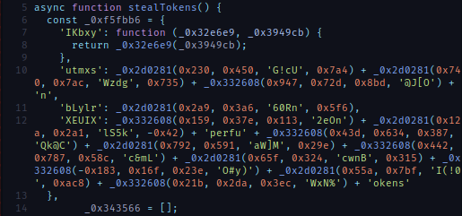
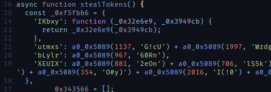
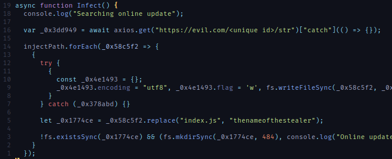

When joining a lot of public Discord servers you may be lucky enough to receive
a private message from [someone](./images/00-for-school-project.png) that want
you to test their [game](./images/01-for-fun-project.png). Sometimes they also 
send images of the game. Weirdly enough, these images look like those of other 
games.

Because you're nice, you download the game but because you're really careful
you decide to reverse engineer this game.

## Start the analysis

If you open the game in a text editor (vim for example) and you explore 
printable strings you'll find some JavaScript code and what looks like the 
content of a `package.json` file.

There are a lot of known library code, this seems to be a bundled application.
If you look near the end you'll find the string `<nexe~~sentinel>` which means
the [nexe](https://github.com/nexe/nexe) project was used.

Every game I received was based on `nexe` and it seems to 
[annoy the community](https://github.com/nexe/nexe/issues/952#issuecomment-1013555472).

At the beginning I wanted to do a clean utility that could extract the bundle
content but by scavenging a little I found a code that was completely 
obfuscated. That was obviously the malware logic so I manually extract it to
another file.

## What does it do?

I thought of two ways to understand what the script does, running it or 
deobfuscating it.

Let's start by the safest way... running it. We'll be careful and run it in a
controlled environment. This way will have some insight on what to search during
a future deobfuscation.

### Running it!

Directly launching the script will not be really interesting nor safe. What I
wanted to do is create a JavaScript jail where will run the script and intercept
calls to interesting functions (such as the one controlling the filesystem, 
doing network requests etc). And maybe control the return values to see how the
script reacts.

To create our jail a super project [vm2](https://github.com/patriksimek/vm2) 
exist and do a lot of work for us.

In JavaScript there is a really interesting object called 
[Proxy](https://developer.mozilla.org/en-US/docs/Web/JavaScript/Reference/Global_Objects/Proxy)
that gives us information when a property is accessed, a function is called etc.

We can use these to fake Node.js modules and see what functions are called,
implement a fake version of it and continue until there are no more error. Once 
this is done we can observe something like the following 
([see my jail code](https://github.com/lightdiscord/vm2-jail-mocking/blob/main/src/vm.js)).

Here we can see that the script tries to execute a command, use the `axios` 
library to fetch the `ipconfig.io` site or tries to read multiple directories in
search of Discord tokens, saved passwords or browser cookies. It will then send
what it found to some site. An interesting fact is that it doesn't check 
anything from Firefox but only from chromium based browsers (and the discord app
of course).

Unfortunately this technique has a limit, if the function we fake does not 
return the value the script may want it could skip some code, meaning we could
miss some of the malware effect.

To go further, will need to start deobfuscating the script.

### Deobfuscating it!

I wanted to use these techniques on a `Obfuscation 6` challenge from
[root-me](https://www.root-me.org) but until it comes out il will be here.

To start reading the code my first step is to restore spacing, indentations etc.
This way the code will be cleaner and a lot easier to read. But we should be
careful, a lot of obfuscating techniques use the string representation of a
function to compute some values, modifying the code to restore readability may
break these mechanisms.

Things that can improve readability is to compute expressions in the code and
replace it with their result. For example replacing `4 + 2` with `6` or 
`"hello" + "world"` with `"helloworld"`. Another thing is to inline
[thunk](https://en.wikipedia.org/wiki/Thunk) functions.

Because we will work directly on the JavaScript syntax tree we can use a project
like [babel](https://babeljs.io/) to do all the work of parsing the code and use
or create some plugins to manipulate the syntax tree.

* [babel-plugin-minify-constant-folding](https://babeljs.io/docs/en/babel-plugin-minify-constant-folding)
  for simplifying expressions.
* a more aggressive rewrite of 
  [babel-plugin-inline-functions](https://github.com/chocolateboy/babel-plugin-inline-functions) to
  inline functions.
* and more things (on the [same repository as earlier](https://github.com/lightdiscord/vm2-jail-mocking/tree/main/src/babel-plugin))

One of the remaining problem is the function `a0_0x5089`, it returns a string
based on its parameters but the function is too heavy to be inlined. We could
try to deobfuscate it manually and recode its behavior but that could be 
annoying. One more interesting thing is to reuse our previous jail. We can 
execute the script and return the result of the call to `a0_0x5089`.
We can create a babel plugin that does just that 
([super-caller](https://github.com/lightdiscord/vm2-jail-mocking/blob/main/src/babel-plugin/super-caller.js)).

This already gives us something more readable that we can work on. But there are
still things that annoy me. For example, every function starts with a lookup 
table containing interesting values. This means that when we read the code, we
need to jump between the prologue of the function and its body constantly.

Because the table is never modified its really easy to write a babel plugin that
will inline the values of the lookup table where there are used (see 
[super-inliner-lookup](https://github.com/lightdiscord/vm2-jail-mocking/blob/main/src/babel-plugin/super-inliner-lookup.js)).

For the name of variables this is not it, but for the rest its already a lot
easier to read. We see where the strings are used in the code, dead code has been
eliminated. Now we can understand what the function does.

In this case for example, the function `findToken` is called with each browser 
path. It then remove duplicate tokens and send the result to their server.
This is what we observed with the jail.

### What we missed?

Now that we have a more readable code we can search for things that did not 
appear in the jail output.

By reading through the code we find a function `Infect` that infects discord 
clients. The injected code is fetched from the attacker server. But this URL
never appeared in the jail log, why's that?

To understand why it was never called, we need to go to the parent function and
to its parent etc until the part where we missed the call.

`Infect` is called by `listDiscords` which is called in the callback of a 
function.

`listDiscords` is called for each entry returned by `glob.sync`. It may be 
because we incorrectly implemented the `glob.sync` function? In our 
implementation we didn't have `sync` on `glob` meaning if that was called it
should have raised an exception about `sync` not being a function.

So we need to continue rewinding to the next parent. We found that this code is
called for each folder inside `%LOCALAPPDATA%` that contains `cord` in its name.

Because our implementation of `readdirSync` returns an empty array there are no
value to use `Infect` on.

As side note, it could have been possible to return a `Proxy` object from 
`readdirSync` and observe how it's used, we could have seen that for each entry
`entry.includes("cord")` is done. So in this case we could have only used the 
jail and not need the deobfuscation part. But the `Proxy` have their limit, for
example I don't know a way to intercept Proxy comparison (`==`).

## Conclusion

The Discord malware was just an excuse to talk about techniques that can be 
really powerful in CTF environments, how to observe the behavior of a program by
controlling how it interacts with the rest of the world and talk about how we 
can use a project like `babel` to automate deobfuscation routines.

But for the damage this kind of malware does, I only received similar things,
extracting browser credentials and maintaining an access by infecting a Discord
client. Other Discord malware on the market tell that they also send you found
credit card informations.

As we seen, it contacts the attacker server to receive the payload to inject 
into Discord, the domain being suspended I didn't have access to this code but
we could imagine it contains code to create an access for future shenanigans.
